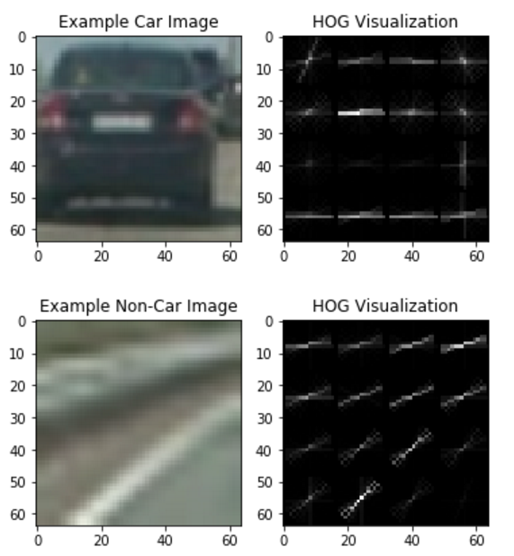
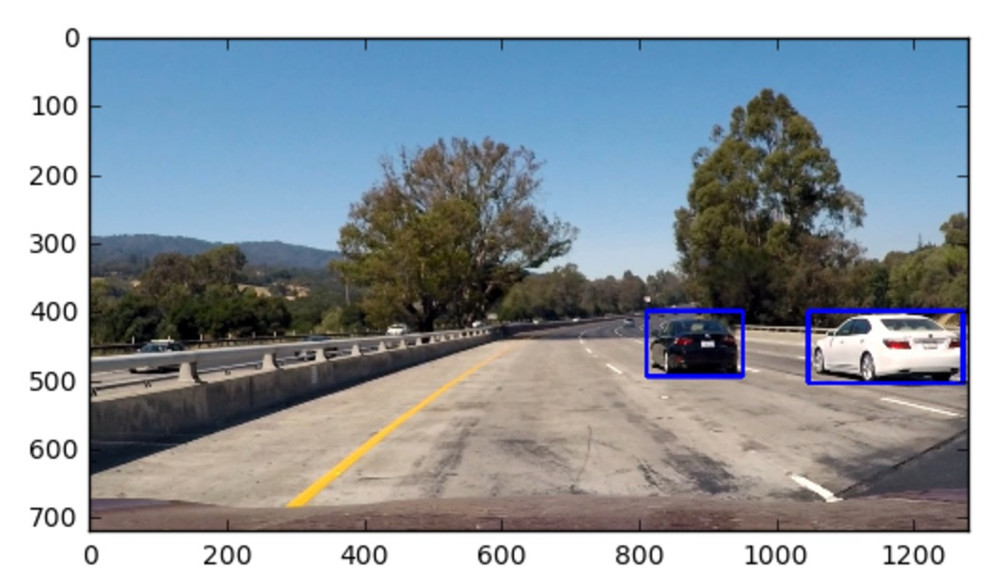

# Vehicle Detection and Tracking
## Goal and steps of this project

The goals/steps of this project are the following:
* Perform a Histogram of Oriented Gradients (HOG) feature extraction and train a classifier.
* Optionally, apply color transform and append binned color features and histograms to HOG feature.
* Note: don't forget to normalize your features and randomize a selection for training and testing.
* Implement a sliding-window technique and use your trained classifier to search for vehicles.
* Run your pipeline on a video stream and create a heat map of recurring detections frame by frame.
* Estimate a bounding box for vehicles detected.

## Overview
Detect vehicles using HOG + SVM classifier with sliding windows. The overall pipeline is the following:

* Gather and organize the data
* Perform a Histogram of Oriented Gradients (HOG) feature extraction on a labeled training set of images
* Train a linear SVM classifier on normalized HOG features
* Implement a sliding-window technique and use trained classifier to search for vehicles in images
* Run the above steps on a video stream and create a heat map of recurring detections frame by frame to reject outliers and follow detected vehicles.
* Estimate a bounding box for vehicles detected.

## Rubric Points
### Here I will consider the rubric points individually and describe how I addressed each point in my implementation.  

---
### Writeup / README

#### 1. Provide a Writeup / README that includes all the rubric points and how you addressed each one.  

### Histogram of Oriented Gradients (HOG)

#### 1. Explain how you extracted HOG features from the training images.

In order to organize the data, I ran the third cell to create 'data.p' in my working directory with the download `vehicle` and `non-vehicle` images. The pickle file 'data.p' contains numpy arrays representing the vehicle and non-vehicle images. I started by reading in all the `vehicle` and `non-vehicle` images.  Here is an example of one of each of the `vehicle` and `non-vehicle` classes:

"vehicle" class:

"non-vehicle" class:

The code for extracted HOG features is contained in the fourth code cell of the IPython notebook in the function `get_hog_features()` by using scikit-learn's `hog()` function. I then explored different color spaces and different `skimage.hog()` parameters (`orientations`, `pixels_per_cell`, and `cells_per_block`).  I grabbed random images from each of the two classes and displayed them to get a feel for what the `skimage.hog()` output looks like. Here is an example using the `RGB` color space and HOG parameters of `orientations=30`, `pixels_per_cell=(16, 16)` and `cells_per_block=(2, 2)`. Below is a visualization of the HOG features on the example vehicle and non-vehicle images.

Vehicle and non-vehicle HOG:

#### 2. Explain how you settled on your final choice of HOG parameters.

To extract the optimal HOG features, I experimented with different color spaces and tweaked different parameters. I iterated through multiple loops of HOG feature parameter tweaking, visualizing static images, visualzing the final effect on video, more HOG feature parameter tweaking, etc.

After much experimentation, I settled on the following HOG feature extraction parameters:

* Color space: RGB
* Channel: (all)
* Orientations: 30
* Pixels per cell: 16
* Cells per block: 2

The above parameters are hard-coded in the second cell in the Ipython notebook.

#### 3. Describe how (and identify where in your code) you trained a classifier using your selected HOG features (and color features if you used them).

I trained a linear SVM using these HOG and color features. The code to do so is in the function `train()`, where I first extracted the HOG features via `extract_features()`. Then, I intentionally unbalance the data, such that the non-vehicle to vehicles ratio is 3:1, via the following line of code: `X = np.vstack((car_features, notcar_features, notcar_features, notcar_features)).astype(np.float64)` to reduce the false positives. After the above, I normalize the features by using scikit-learn's StandardScaler. Using a train/test split of 95/5 (test accuray is not important in this project), I trained the SVM, and saved the final trained model to `model.p`. I got 95%+ test accuracy in all of my parameter tuning experiments. 

### Sliding Window Search

#### 1. Describe how (and identify where in your code) you implemented a sliding window search.  How did you decide what scales to search and how much to overlap windows?

I implemented a basic sliding window search to detect areas in the image where a vehicle is likely present. I only used this window size 96*96 for this project. A potential enhancement is to use multiple window sizes across different areas of the image, e.g. smaller window sizes for areas closer to the horizon. Since we know cars will not be present in the sky and treetops, I limited the search area of my sliding window search to `x_start_stop=(100, 1180), y_start_stop=(400, 500)`. This allows the vehicle detector to perform faster than searching through the entire image, and also reduces potential false positives in areas like the sky and treetops. I chose an overlap percentage of 0.7 (i.e. 70%). I found this gave me reliable detections with multiple detected bounding boxes on vehicles and this allows to create a high-confidence prediction of vehicles in the heat map (more details later) to reject potential false positives. The code to perform my sliding window search is in the functions `slide_window()` and `search_windows()`. These functions serve the same purpose as those presented in the lecture notes, where `slide_window()` returns a list of windows to search, and `search_windows()` uses the pre-trained HOG+SVM classifier to classify the image in each window as either "vehicle" or "non-vehicle". The parameter `pct_overlap` is the percentage overlap. An example of implement the sliding window search on an image is shown as below:

#### 2. Show some examples of test images to demonstrate how your pipeline is working.  What did you do to optimize the performance of your classifier?

As seen previously, there are some false positive in the example above. I used the heat map to predict the final bounding box. I created a heat map by adding the contributions of each predicted bounding box. After a heat map is generated, we threshold the heatmap into a binary image, then use scikit-learn's `label()` function to draw the final bounding boxes based on our thresholded heat map. The heatmap threshold is specified by the variable `heatmap_thresh`. Using this method, the final bounding boxes are predicted as such:

### Video Implementataion

In a video stream, I firstly reduce the number of false positives by keeping track of a cumulative heat map over the past 30 frames in a video, and threshold the cumulative heatmap. The cumulative heatmap is enabled by a queue of "hot windows", and the implementation is in the class `HotWindows()`. For the cumulative heat map, I chose a window history of 30 frames, and a heat map threshold of 30. These settings are in the variables `num_frames` and `heatmap_thresh`, respectively. Then, I defined a `annotate_image` and `annotate_video` as the pipelines to process the video.

Here's a [link to my video result](./project_out.mp4)

### Discussion

#### 1. Briefly discuss any problems / issues you faced in your implementation of this project.  Where will your pipeline likely fail?  What could you do to make it more robust?

The main challenge for this project is to reduce the number of false positives and detection duplicates by using parameter tuning. Even though the HOG+SVM classifier had good results, it did not necessarily mean good results in the overall vehicle detection task. Potential areas were the current vehicle detection pipeline would fail with the bad road conditions and more tests should be done to improve the vehicle detection. We can also use different classifier to improve the final accuracy of vehicle detection. For real time application, we need to increase the detection speed.
